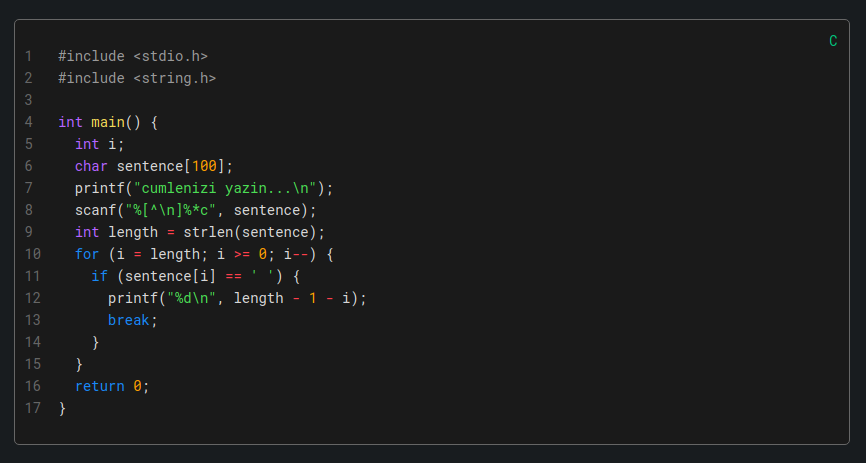
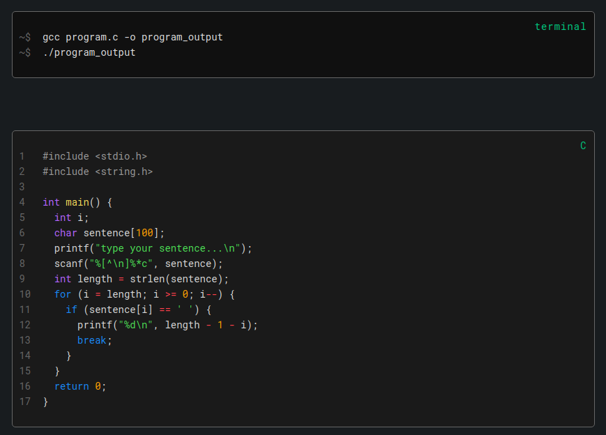
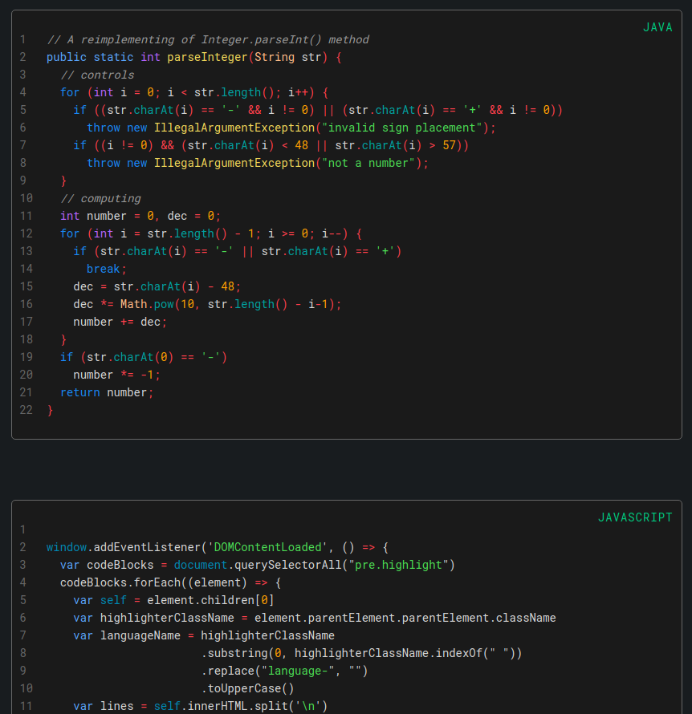
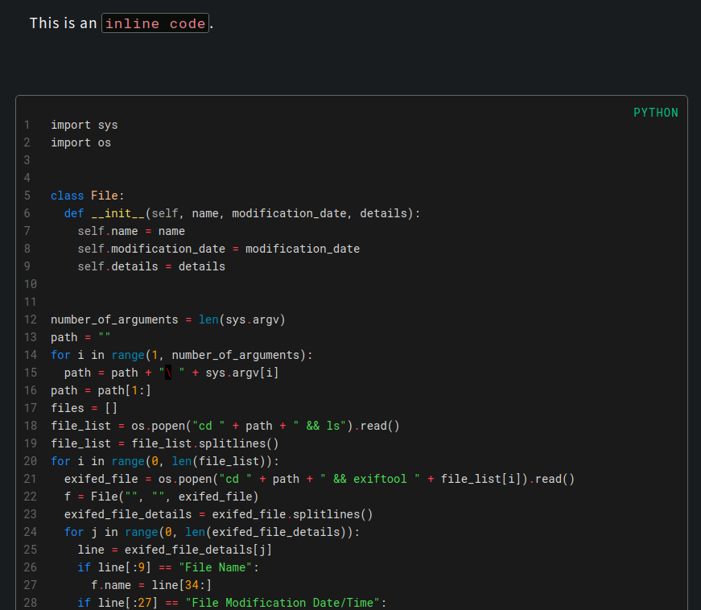

# jekyll-code-style

[Jekyll](https://jekyllrb.com/) is a static site generator Ruby framework. A Jekyll webpage can be hosted on GitHub Pages, and Markdown structure and GitHub Pages does not have a default theme for the code blocks in a page that have line numbers and language names. Unless you do not use any Jekyll theme which is written by a designer.

It is essential, for a blog page that focuses on software, to have stylish and pro-looking code blocks. I have written a code block style and syntax highlighting theme for Jekyll pages for myself. I did not try to upload any of my code into [Jekyll Themes](http://jekyllthemes.org/), I am using my own style for my page but also I simply decided to put my code block style as a repo, instead. 

## What Does jekyll-code-style Do?

1. Puts line numbers and programming language name on blocks inside ` ``` ` marks. If the language is terminal (bash), puts `$` signs instead of numbers.
2. Reads the page colors, then generates one color for block background and one for line numbers and comment lines. If platform background is dark, block background be generated a little lighter, otherwise darker.
3. Sets appropriate paddings, margins, font family (Roboto Mono), smooth corners and other properties for `code` and `pre` if they are default.
4. Adjusts inline codes as styled light pink on black.

- Does not put numbers when the number of lines less then 6.
- Numbers and language name are unselectable and do not disturb any space or indentation.
- Inline code and multiline code are completely separated.
- Css file is simple and commented. Easy to customize.

## Usage

This code is basically consists of two files; one JavaScript and one CSS. Put `put-code-elements.js` and `jekyll-code-style.css` on your suitable assets directories and bind them into your Jekyll project's `<head>` tags.

```html
<link rel="stylesheet" href="{{ "YOUR_PATH/jekyll-code-style.css" }}">
<script type="text/javascript" src='{{ "YOUR_PATH/put-code-elements.js" }}'></script>
```

In order for ghost-code run properly, code blocks must implemented in the Markdown file as given below:

    ```LANGUAGE_NAME
        --codes--
    ```

Or one tab shifted as a block.

```
<TAB>--code line--
<TAB>--code line--
<TAB>...
```

If the second is chosen, code runs properly but any language name does not appear in the code block. I recommend the first one.

I have not written any code for Jekyll's `Liquid` highlighter syntax. My code **does not work properly** if you write your codes like this:

```

--codes--

```

***

Feel free to inform me about any bugs, suggestions etc.

### Screenshots





