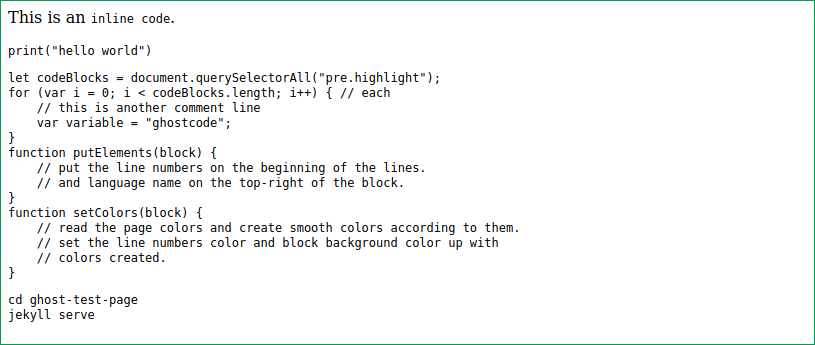
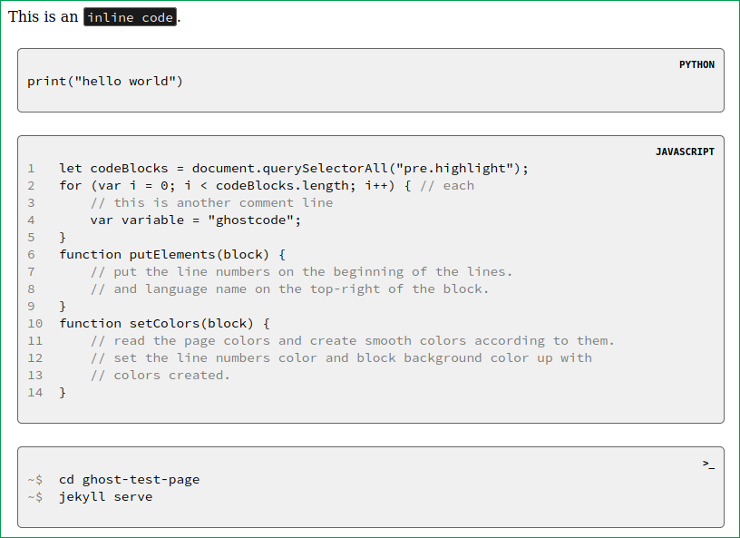
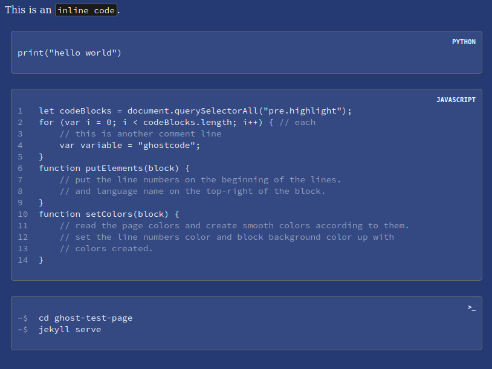
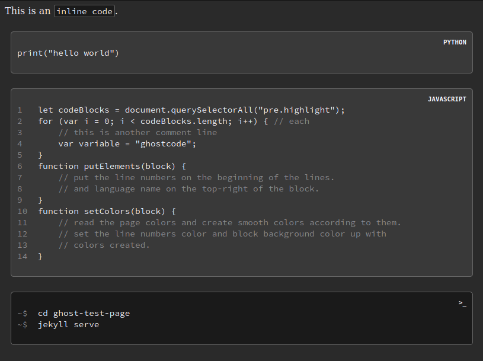

# ghost-code
A regulator for Jekyll webpage code blocks written in Javascript.

It is essential for a blog page that focuses on software to have stylish, pro-looking code blocks. Some evening I thought I could write one for myself, instead all bootstraps, templates and themes.

Name *ghost* does not stand for *hidden* or *mysterious* or anything like that. I choose because it represents those like *soft*, *transparent-like*, *easy-to-eye*; not a hard modifier of other colors in appearance, but smooth.

## Usage

This code is basically two files and a true type font directory. Put `ghostcode.js`, `gostcode_style.css` and directory `font` on your suitable assets directories and bind them into Jekyll `<head>` tags. Font directory and css file must be in the same directory.

```html
<link rel="stylesheet" href="{{ "YOUR_PATH/ghostcode-style.css" }}">
<script type="text/javascript" src='{{ "YOUR_PATH/ghostcode.js" }}'></script>
```

In order for ghost-code run properly, code blocks must implemented in the Markdown file as given below:

    ```LANGUAGE_NAME
        --codes--
    ```

Or one tab shifted as a block.

<TAB>--code line--
<TAB>--code line--
<TAB>...

If the second is chosen, code runs properly but any language name does not appear in the code block. First is recommended.

I have not written any code for Jekyll `Liquid` highlighter syntax. That will does not work properly:

```

--codes--

```

## What Does the Ghost do?

1. Puts line numbers and programming language name on blocks inside ` ``` ` marks. If the language is terminal (bash), puts `$` signs instead of numbers.
2. Reads the page colors, then generates one color for block background and one for line numbers. If platform background is dark, block background be generated a little lighter, otherwise darker.
3. Sets appropriate paddings, margins, font family (Source Code Pro), smooth corners and other properties for `code` and `pre` if they are default.
4. Adjusts inline codes as styled white on black.

A default HTML page and some code blocks on it:



After ghostcode runs on the page:



- Ghostcode does not force the user's `code` and `pre` colors to change if they are already set, except comment lines. Feel free to use any Syntax highlighter. I am sorry for the comment lines.

For instance, if user sets their page background be navy blue, ghostcode generates a shape of blue, concurrently.



Lastly, there are some lines inside comment marks in `ghostcode-style.css`. Those codes can be activated at the user's will in order for terminal blocks to be ghostwhite-text on soft black background, like a real bash window.




Feel free to inform me about any bugs, suggestions etc.
